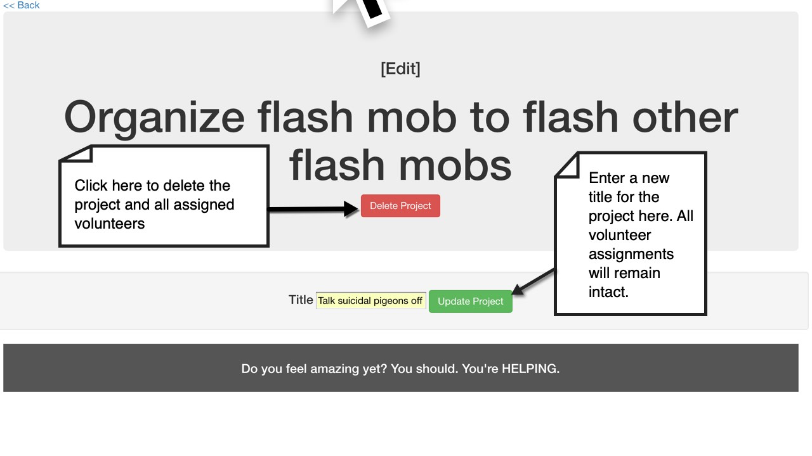

View this site hosted [HERE](https://glacial-ravine-14472.herokuapp.com/) on Heroku.
# Volunteer Tracker

#### _Database app for tracking projects and volunteers._

#### By _**Jared Reando**_

## Description

I'll be honest - this is a pretty basic web application.

BUT, that doesn't mean it's not functional. Or useful!

What's built here is essentially a glorified to-do list with a few vocabulary changes that lend it to the user interested in tracking multiple projects requiring volunteer name tracking.

Here's what you can do here:
- Create projects
- Edit project names
- Add volunteers to existing projects
- Edit volunteer names
- Delete volunteers and projects for various reasons:
  - Project completed
  - Cancellations
  - Crippling shame/failure

Site navigation is straightforward. On the home page, you can create projects by title:

- 


Once a project exists, add volunteers from either the home screen (using the project assignment drop-down menu) or from the project's information page (accessed by clicking the title on the home page):

 - 

 - 

To edit or delete projects, click the "Edit Project" link from the project detail page:

 - 

 - 

To edit or delete volunteers, click a name link from the project detail page:

 - 

- 

## Setup/Installation Requirements

### Installation
* Clone this project repository to your local drive. Link: https://github.com/JaredReando/volunteer-tracker/

* In order for the database connections to function, you'll need to create local DB instances on your machine that match the ones expected by the Volunteer Tracker web app. If this process is unfamiliar, go [HERE](https://www.learnhowtoprogram.com/ruby/ruby-database-basics/installing-postgres-7fb0cff7-a0f5-4b61-a0db-8a928b9f67ef) to learn more about installing and working with PostgresSQL.

* If you already have Postgres set up and running, run these commands in Terminal to clone the project's database structure onto your machine:

  ```
  $ createdb volunteer_tracker
  ```
  ```
  $ psql volunteer_tracker < my_database.sql
  ```
  ```
  $ createdb -T volunteer_tracker volunteer_tracker_test
  ```

* With the databases set up, navigate to the local project directory in Terminal and start the web server with this command:

  ```
  $ ruby app.rb
  ```

* The project will become immediately accessible in your web browser at the address https://localhost:4567.

* To stop the application, press 'CTRL+C' in the server status window of your open Terminal.

* To make changes of your own, open the project in the text editor of your choice (I use _[Atom](https://atom.io/)_ (It's free!)). You will be able to see changes update in the browser immediately upon saving while the application is running.

## Known bugs

* Only text characters (A-Z, a-z) and spaces are permitted as title and name entries. Numbers and special characters are not allowed.

## Support and contact details

_Questions or feedback: jaredreando@gmail.com_

## Technologies

- Created with Ruby 2.5.3.
- Deployed to Heroku using the Sinatra web framework.
- See project GEMFILE for complete list of gems

## Objectives

- [x] Objects are created from a custom class with custom methods.

- [x] Tests are 100% passing. You may not significantly alter the included tests but you may add additional tests as necessary.

- [x] Database is set up correctly.

- [x] Correct set up of a one-to-many relationship.

- [x] Sinatra has required CRUD functionality.

- [x] Project has strong commit history history.

- [x] Project has detailed README with all necessary setup instructions and a description of the project.

- [x] Required functionality was in place by the Friday deadline.

- [x] Student can demonstrate understanding of Ruby concepts if asked.


### License

Copyright (c) **Jared Reando**

Licensed under the MIT License
